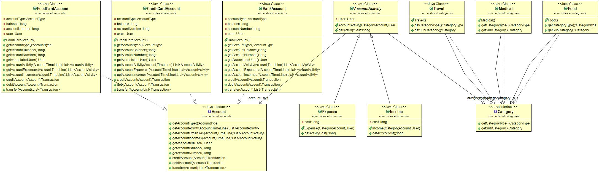

TODO - add  https://sonarcloud.io/api/project_badges/measure?project=vin0010_Expense-Tracker&metric=alert_status
# Expense-Tracker
Expense Tracker with added features.

## Plan
- [Features](#features)
- [Use Cases](#use-cases)
- [Textual Analysis](#textual-analysis)
- [Initial Design](#initial-design)
- Architecture And Tools Usage
- [Class Design](#class-design)
- [Design Review](#design-review)

## Features
 - Currency Usage
 - Categories(Food, Travel, Medical and custom category etc.)
 - Sub Categories(Food - lunch, dinner, snacks etc.)
 - Accounts(Bank, Card and Cash)
 - Charts
 - Suggestions
 - Budget limit alert

## Use Cases
 - Add Expense with Category, Account, Payee, Date, Note
 - Add Income with Category, Account, Date and Note
 - Add Account with Category, Type and Name
 - View Expense on Daily, Weekly and Monthly basis.
 - View Income on Daily, Weekly and Monthly basis.
 - Export income statement on Daily, Weekly and Monthly basis.
 - Export expense statement on Daily, Weekly and Monthly basis.

## Textual Analysis
- **Textual Analysis** is nothing but finding classes and objects from nouns and verbs of use case description.
- Classes
	- Expense
	- Income
	- Account
        - Bank
        - Credit Card
        - Cash
	- Payee
	- Category
        - Food
            - Dinner
            - Lunch
            - Snacks
            - Groceries
        - Travel
            - Fuel
            -
        - Medical
        - Home Appliances
        - Insurance
        - Social
        - Personal
        - Digital
	- Sub Categories

## Initial Design
## Class Design

## Design Review
- Most of the design ideas/features that has been planned is covered.

## Development

## Design Review
- Done by @dkarthikeyan88
